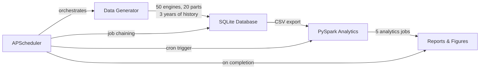

# Engine Fleet Sustainment Analytics Pipeline

Automated sustainment data pipeline for aircraft engine fleet analytics — generates synthetic maintenance data, stores it in SQL, processes it through PySpark, and produces actionable fleet-health reports on an automated schedule.

## Architecture

```
[Synthetic Data Generator] → [SQLite Data Warehouse] → [PySpark Analytics Engine] → [Report Output]
         ↑                                                                                ↑
         └──────────────── Automated via APScheduler (task scheduling) ────────────────────┘
```



## Quick Start

```bash
git clone <repo-url> && cd engine-fleet-sustainment-analytics
pip install -r requirements.txt
python scheduler/pipeline.py --run-once
```

This generates synthetic data, validates integrity, runs all analytics, and produces reports in `reports/`.

To start the scheduled daemon (runs daily at midnight ET):

```bash
python scheduler/pipeline.py --schedule
```

Or use the bash wrapper:

```bash
./scheduler/run.sh
```

## Tech Stack

| Technology | Purpose |
|---|---|
| **SQLite (SQL)** | Relational data warehouse with 5 normalized tables and 10 analytical queries |
| **PySpark** | Databricks-compatible distributed analytics (5 fleet-level jobs) |
| **APScheduler** | Automated task scheduling and pipeline orchestration with cron triggers |
| **Python** | Scripting, synthetic data generation, automation |
| **NumPy** | Realistic statistical distributions (Weibull, Poisson) for data generation |
| **Matplotlib / Seaborn** | 4 static visualizations (heatmap, time series, bar chart, scatter plot) |
| **pytest** | Automated test suite (31 tests across 4 modules) |
| **GitHub Actions** | CI pipeline (lint + test on every push/PR) |

## SQL Query Catalog

All queries are standalone `.sql` files in `database/queries/`:

| # | Query | Key SQL Features |
|---|---|---|
| 01 | Fleet Status Summary | GROUP BY, aggregate functions |
| 02 | Top 10 Costliest Parts | RANK() window function, JOIN |
| 03 | Unscheduled Rate by Model | CASE expressions, HAVING |
| 04 | Mean Time Between Replacement | LAG() window function, CTE, 3-table JOIN |
| 05 | Work Order Turnaround Time | Date arithmetic, standard deviation, subquery |
| 06 | Monthly Maintenance Trend | Recursive CTE (date spine), CROSS JOIN |
| 07 | Failure Prediction Candidates | 4-table JOIN, COALESCE, threshold filtering |
| 08 | Cost Per Flight Hour | RANK() window function, 3-table JOIN, aggregation |
| 09 | Technician Workload Distribution | STRFTIME, window functions, CASE flags |
| 10 | Engine Lifecycle Dashboard | 4 LEFT JOINs, CASE aggregation, date arithmetic |

## PySpark Analytics

Five Databricks-compatible analytics jobs in `analytics/fleet_analytics.py`:

1. **Failure Rate Heatmap** — Unscheduled failures by (model, part category, quarter)
2. **Part Lifecycle Curve** — Kaplan-Meier-style survival percentages at flight-hour intervals
3. **Maintenance Cost Forecast** — Rolling 6-month average with 3-month linear projection
4. **Fleet Availability Score** — Monthly active vs. MRO percentage by fleet type
5. **Anomaly Detection Flags** — Premature failures (<50% MTBF) with severity scoring

## Databricks Compatibility

All PySpark code runs both locally and in Databricks with zero code changes:

1. Upload CSVs from `data/csv/` to DBFS:
   ```python
   # In Databricks notebook
   dbutils.fs.cp("file:/path/to/engines.csv", "dbfs:/FileStore/tables/engines.csv")
   ```
2. Use the existing `spark` session (skip `spark_session.py`)
3. Load tables with DBFS paths:
   ```python
   engines = spark.read.csv("/FileStore/tables/engines.csv", header=True, inferSchema=True)
   ```
4. Call any analytics function directly:
   ```python
   from fleet_analytics import failure_rate_heatmap
   df = failure_rate_heatmap(spark, tables)
   df.display()
   ```

## Sample Output

The pipeline generates 4 visualizations in `reports/figures/`:

- **Failure Heatmap** — Where failures cluster across engine models and part categories
- **Monthly Cost Trend** — Rolling average maintenance cost with forecast overlay
- **Fleet Availability** — Percentage of fleet active vs. in MRO each month
- **Anomaly Scatter** — Premature failures plotted against MTBF with severity coloring

Plus a markdown summary (`reports/summary.md`) with key metrics.

## Testing

```bash
# Run the full test suite
pytest tests/ -v

# Run individual test modules
pytest tests/test_data_integrity.py -v   # 9 tests — FK, temporal, count checks
pytest tests/test_sql_queries.py -v      # 12 tests — all 10 queries + edge cases
pytest tests/test_spark_analytics.py -v  # 6 tests — all 5 PySpark jobs
pytest tests/test_pipeline.py -v         # 4 tests — end-to-end + failure handling
```

## Project Structure

```
├── scheduler/           APScheduler pipeline orchestrator
│   ├── pipeline.py      --run-once and --schedule modes
│   ├── config.yaml      Paths, cron schedule, generation params
│   └── run.sh           Bash wrapper
├── data_generator/      Synthetic data generation
│   ├── generate.py      50 engines, 20 parts, 3 years of history
│   └── validate.py      Referential integrity + consistency checks
├── database/            SQL schema and query library
│   ├── schema.sql       5 normalized tables
│   └── queries/         10 standalone analytical queries
├── analytics/           PySpark analytics engine
│   ├── spark_session.py Session factory (Databricks-compatible)
│   ├── fleet_analytics.py  5 analytics jobs
│   └── run_all.py       Runner with CSV + Parquet output
├── reports/             Auto-generated output
│   ├── generate_report.py  4 matplotlib/seaborn visualizations
│   ├── summary.md       Key metrics and figures
│   ├── data/            CSV results from analytics
│   ├── parquet/         Parquet results from analytics
│   └── figures/         PNG visualizations
├── tests/               pytest suite (31 tests)
├── data/                SQLite DB + CSV exports (auto-generated)
└── .github/workflows/   GitHub Actions CI
```

## Requirements

- Python >= 3.9
- Java 17 (required for PySpark)
- Dependencies: `pip install -r requirements.txt`
